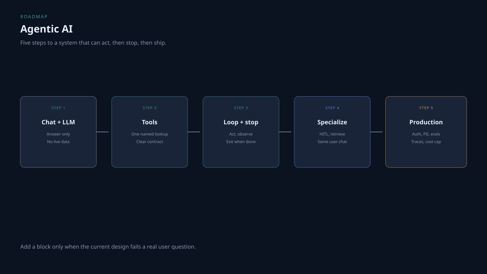

# Agentic AI roadmap

Build an agent that can look things up, stop, ask a human when money moves, and then survive real users.

Add a block only when the current design fails a real question. Five steps. Not a framework tour.

## Step 1 — Chat + LLM

The model answers from the prompt. No live order. No tools.

You can ship a FAQ bot. You cannot answer “where is my order?”

**Read:** none yet on Insight Veda for this exact step.  
**Practice:** [Brass Vernier · Agents & orchestration](https://insightveda.com/scenarios?set=brass-vernier&domain=agentic-architecture)  
**Watch:** [Agentic AI system design, Part 1](../videos/agentic-ai-system-design-part-1.md)

## Step 2 — Tools

Give the model a named lookup with a schema: what it takes, what it returns, when not to call it.

**Read:** [Tool descriptions and schemas](https://insightveda.com/chapters?chapter=ch-tool-descriptions-schemas)  
**Practice:** [Brass Vernier · Tools & integrations](https://insightveda.com/scenarios?set=brass-vernier&domain=tools-integrations)  
**Watch:** [Part 1](../videos/agentic-ai-system-design-part-1.md)

## Step 3 — Loop and stop

One tool call is a capability. A loop is the control cycle: act, observe, stop. Honor a completion signal. Caps are a backstop.

**Read:** [The agent loop and stop conditions](https://insightveda.com/chapters?chapter=ch-agent-loop-stop)  
**Practice:** [Brass Vernier · Agents & orchestration](https://insightveda.com/scenarios?set=brass-vernier&domain=agentic-architecture)

## Step 4 — Specialize

Coordinator plus specialists. Human approval before money. Retrieve policy; do not guess it.

**Read:** [Chunking and overlap](https://insightveda.com/chapters?chapter=ch-chunking-overlap) (retrieval unit)  
**Practice:** [Brass Vernier · Data & knowledge](https://insightveda.com/scenarios?set=brass-vernier&domain=data-knowledge)  
**Watch:** [Part 1](../videos/agentic-ai-system-design-part-1.md)

## Step 5 — Production

Identity, authorization, PII masking, evals, traces, cost cap. The model is not the security boundary.

**Read:** [Authentication for AI applications](https://insightveda.com/chapters?chapter=ch-auth-ai-applications)  
**Practice:** [Brass Vernier · Security & guardrails](https://insightveda.com/scenarios?set=brass-vernier&domain=security-guardrails)  
**Watch:** [Agentic AI system design, Part 2](../videos/agentic-ai-system-design-part-2.md)

## Topic

[Agentic AI system design](../topics/agentic-ai-system-design.md)
