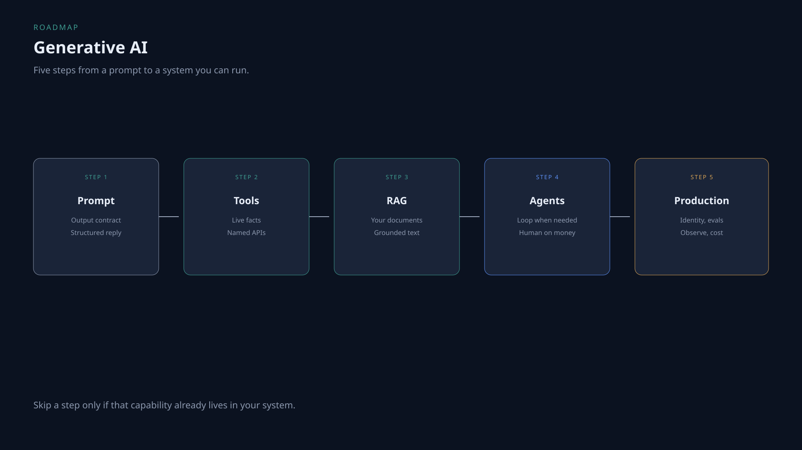

# Generative AI roadmap

The wide path: from a prompt to a system that uses tools, documents, and agents without skipping production.

Skip a step only if that capability already lives in your system.

## Step 1 — Prompt and output

Write what the model must return. Prefer a schema over a vibe.

**Read:** [Structured output basics](https://insightveda.com/chapters?chapter=ch-structured-output-basics)  
**Practice:** [Brass Vernier · Prompts & outputs](https://insightveda.com/scenarios?set=brass-vernier&domain=prompting-output)

## Step 2 — Tools

Connect live facts. A tool is a named API with a contract, not “the model will browse.”

**Read:** [Tool descriptions and schemas](https://insightveda.com/chapters?chapter=ch-tool-descriptions-schemas)  
**Practice:** [Brass Vernier · Tools & integrations](https://insightveda.com/scenarios?set=brass-vernier&domain=tools-integrations)

## Step 3 — RAG

Documents and policy go through retrieval. See the [RAG roadmap](rag.md) when this is the job.

**Read:** [Chunking and overlap](https://insightveda.com/chapters?chapter=ch-chunking-overlap)  
**Practice:** [Brass Vernier · Data & knowledge](https://insightveda.com/scenarios?set=brass-vernier&domain=data-knowledge)

## Step 4 — Agents

Add a loop when one shot is not enough. Stop conditions, specialists, human approval. See the [Agentic AI roadmap](agentic-ai.md).

**Read:** [The agent loop and stop conditions](https://insightveda.com/chapters?chapter=ch-agent-loop-stop)  
**Practice:** [Brass Vernier · Agents & orchestration](https://insightveda.com/scenarios?set=brass-vernier&domain=agentic-architecture)  
**Watch:** [Agentic AI system design](../topics/agentic-ai-system-design.md)

## Step 5 — Production

Auth, PII, evals, traces, cost. Same controls whether the app is “just RAG” or a full agent.

**Read:** [Authentication for AI applications](https://insightveda.com/chapters?chapter=ch-auth-ai-applications)  
**Practice:** [Brass Vernier · Security & guardrails](https://insightveda.com/scenarios?set=brass-vernier&domain=security-guardrails)  
**Watch:** [Part 2](../videos/agentic-ai-system-design-part-2.md)
