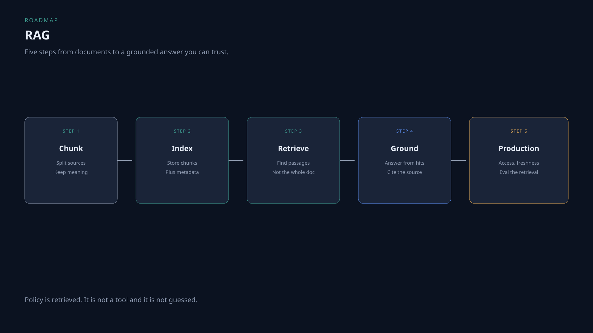

# RAG roadmap

Put the model on *your* documents without stuffing the handbook into the prompt.

Policy is retrieved. It is not a tool.

## Step 1 — Chunk

Split sources into pieces that still mean something. Overlap at boundaries. Fix this before you buy a fancier index.

**Read:** [Chunking and overlap](https://insightveda.com/chapters?chapter=ch-chunking-overlap)  
**Practice:** [Brass Vernier · Data & knowledge](https://insightveda.com/scenarios?set=brass-vernier&domain=data-knowledge)

## Step 2 — Index

Store chunks with enough metadata to debug a bad answer (source, section).

**Read:** [Chunking and overlap](https://insightveda.com/chapters?chapter=ch-chunking-overlap)  
**Practice:** [Brass Vernier · Data & knowledge](https://insightveda.com/scenarios?set=brass-vernier&domain=data-knowledge)

## Step 3 — Retrieve

Return the passages that match the question. Not the whole corpus.

**Read:** [Data & knowledge](https://insightveda.com/chapters?domain=data-knowledge)  
**Practice:** [Brass Vernier · Data & knowledge](https://insightveda.com/scenarios?set=brass-vernier&domain=data-knowledge)

## Step 4 — Ground

The model answers from retrieved hits and can point at the source. If the hit is missing, say so.

**Watch:** [Agentic AI system design, Part 1](../videos/agentic-ai-system-design-part-1.md) (policy is retrieved, not guessed)

## Step 5 — Production

Who may see this chunk. Is the index fresh. Did retrieval actually return the right clause. Measure that before you add agentic retrieval.

**Read:** [Authentication for AI applications](https://insightveda.com/chapters?chapter=ch-auth-ai-applications)  
**Practice:** [Brass Vernier · Security & guardrails](https://insightveda.com/scenarios?set=brass-vernier&domain=security-guardrails)

## Related

- [Agentic AI roadmap](agentic-ai.md) — retrieval sits inside step 4 there
- [Generative AI roadmap](gen-ai.md) — RAG is step 3 there
